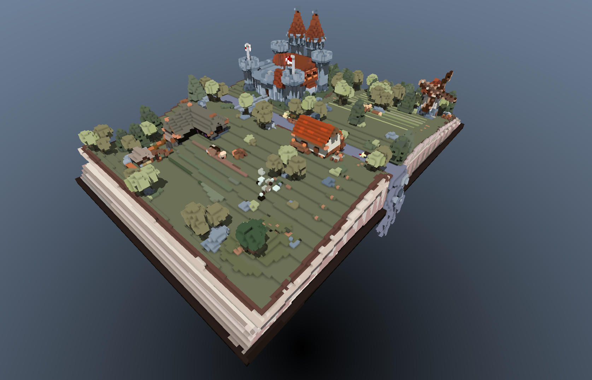
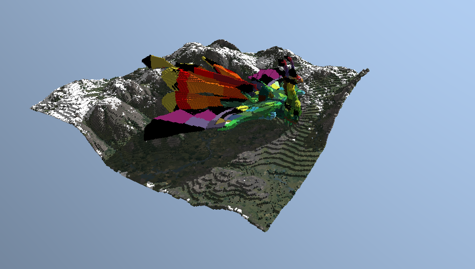
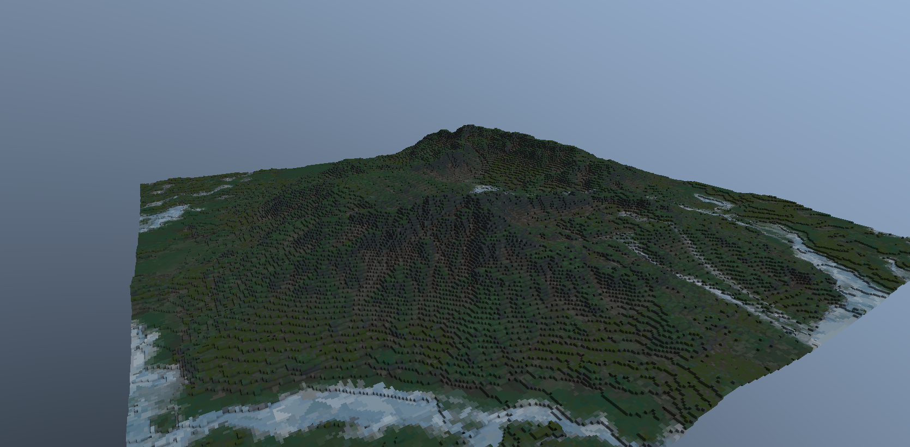

# Project Voxin 
*By Google 2*

A GPU-accelerated, raytraced voxel engine written in Rust and WGPU. Project Voxin features the ability to convert standard 3D models (`.glb` / `.obj`) into voxel environments in real-time, rendering them with advanced compute shaders and storing them in an ultra-optimized, bit-packed format.

## Developers

| Name | Links |
| :--- | :--- |
| **Tim Hedlund** | [LinkedIn](#) • [Email](#) |
| **Lucas Axberg** | [LinkedIn](#) • [Email](#) |
| **Anton Lennström** | [LinkedIn](https://www.linkedin.com/in/anton-lennstr%C3%B6m/) • [Email](mailto:antonlen@kth.se) |

---

## Showcase

 

 

 

## Features

* **Raytraced Rendering:** Custom WGSL compute shaders perform raycasting through the voxel grid using a hybrid DDA & stack-based SVO traversal.

* **Advanced Lighting:** Features directional shadows, procedural sky, and physically-based Voxel Ambient Occlusion (AO) using custom neighborhood masking.

* **Procedural Worldgen:** Ability to generate infinite worlds and dynamically place imported 3D models directly into the scene.

* **Modern Model Parsing:** Full support for `.glb` (glTF 2.0) including Scene Graph traversal, transforms, and `.obj` fallback.

* **Smart Texturing:** Extracts base colors, UV maps, and flat PBR colors, handling sRGB to Linear color space conversions natively.

* **Seamless Mesh Compositing:** Allows multiple independent 3D models to be parsed, loaded, and seamlessly integrated into the same unified environment.

* **Ultra-Optimized Storage:** Leverages the underlying Sparse Voxel Octree structure and custom compression to achieve exceptionally small file sizes when saving parsed models.

* **High Performance:** Uses `glam` for SIMD-accelerated CPU math and highly packed bitwise data structures to heavily reduce VRAM usage.

## Run Instructions

### Prerequisites
* Rust toolchain (latest stable)
* A GPU compatible with Vulkan/Metal/DX12 (WGPU support)

### Running the Engine
Clone the repository and run via Cargo:
```bash
git clone https://github.com/IndaPlus25/laxberg-timhedl-antonlen-project.git

cd laxberg-timhedl-antonlen-project

cargo run --release
```

## License
MIT License
