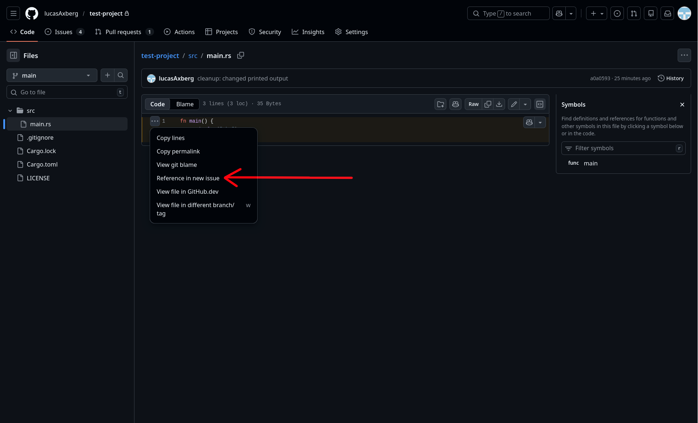
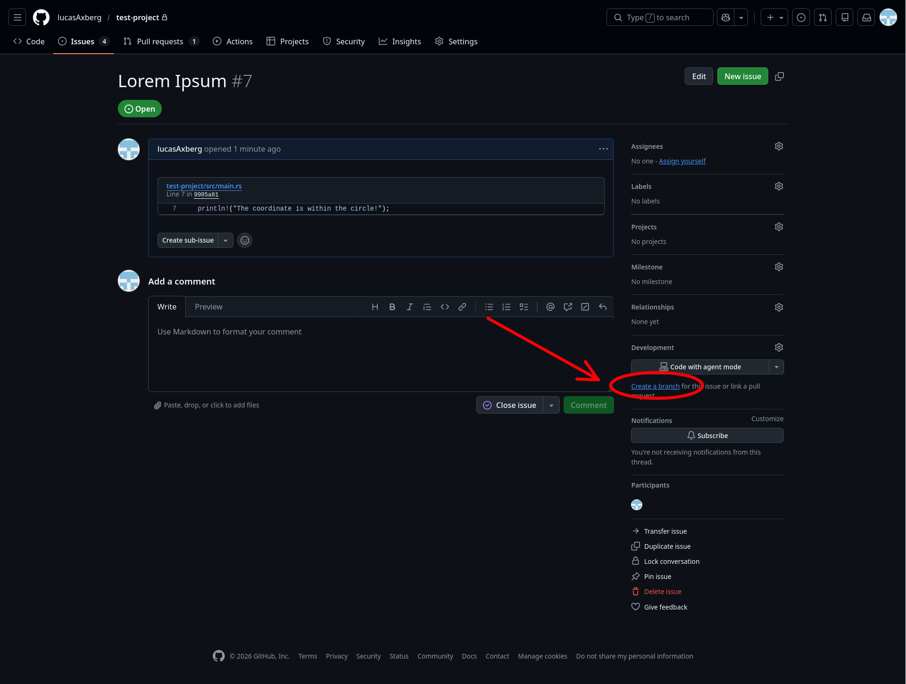

# Github Workflow

## 1. Branches
### 1.1 Development Branch
The development branch should only contain working code for fully implemented features. Features are developed on a separate branch and merged into development when completed.
### 1.2 Feature Branch
A separate branch is created for each feature to be implemented. Any problems discovered in code not relevant to the current feature should be marked in an issue.

## 2. Commits
Each commit should only contain changes made to a separate function or code snippet, as well as the code affected by the change, if the affected code is to be changed on the current branch.
#### Examples
| Change | Commits |
| ------ | ------- |
| A piece of code used in multiple places, is converted into a function, and a function call is added to the places the code is used | A single commit (if the functionallity of the code is unchanged) |
| The function signature is changed (name, arguments or return type), and the calls to the function are modified to mathch the new signature | A single commit |
| More features are added to a function which requires an extra argument | Multiple commits (for changed function header, and for new feature) |

## 3. Planning
For planning the project, a 3-layer structure will be used.

### Layer 1: Milestones
Here the big milestones of the project are documented. These should be a release of our project, i.e., the MVP release or "Should Have" release, for example. A milestone is therefore completed once the development branch is merged into the main branch. 

The milestones should follow the schedule outlined in the specifications. The milestones will help us stay accountable regarding the schedule (GitHub will be mad if we miss ;c).

### Layer 2: Big Feature Issues
Under the milestones, we will create issues that correspond to the different features we want for that release. These are bigger features and correspond to the features listed under the releases in the specification doc. 

In our current workflow, one person is responsible for one of these issues, but due to differences in the size of issues assigned to developers, collaboration is used when possible to spread the workload. 

### Layer 3: Small Feature Issues
These issues are created as sub-issues for the Layer 2 issues, and outline what needs to be done to complete the Layer 2 issue. These issues should, for example, outline a smaller feature, and should be closed with one or a few commits. These are good for tracking progress and simplify collaboration without excessive communication between developers.

## 4. Issues

The following instructions apply to issues created outside of the milestone planning process. Because these issues are still connected to a milestone, they should be created under the specific milestone they pertain to. 

An issue ***should*** be created for:

- Problems in **any** code, regardless of whether you are currently assigned to modify it
- Improvements/Changes in **any** code, regardless of whether you are currently assigned to modify it
- Feature suggestions

### 4.1 Create issues with code reference
1. Open the file in GitHub
2. Click the line number of the code
3. Click the `...` next to the line numbers
4. Select `Reference in new issue`.
5. Name the issue and add a description, keeping an empty line above and below the link
6. Add the appropriate label describing the type of issue in the Labels tab on the right side
7. Include the issue in the project by selecting it in the projects tab on the right side

> To select multiple lines, click the first line and shift click the last

### 4.2 Create issues without code reference
1. Open the issues tab
2. Click create new issue
3. Give the issue a name and a description
4. Add the appropriate label describing the type of issue in the Labels tab on the right side
5. Include the issue in the project by selecting it in the projects tab on the right side

### 4.3 Resolving Issues
When resolving an issue, separate branch should be created. Given an issue `#3 some-issue`, a branch should be created named `issue/3-some-issue`.

1. Open the issue on GitHub
2. Click `Create a branch` in the right side tabs
3. Insert `issue/` at the beginning of the given branch name
4. Change branch source to development

> This makes it so the issue is automatically closed when the issue branch is merged

When the issue is resolved, create a pull request to merge it into the development branch

## 5. Pull Requests
### 5.1 Creating a pull request
When the feature or issue is completed, a pull request needs to be created to merge it into development

1. Make sure your branch exists on GitHub and is updated with the latest changes (run `git push`)
> If the branch has not yet been added to GitHub, simply run `git push -u origin <branch-name>` to add it
2. Go to the pull requests tab and click `New pull request`
3. For the base branch, select development and for the compare select your branch
4. Click `Create pull request`, and add a title and description to it

### 5.2 Suggesting changes
If the code submitted for a pull request is flawed, you can suggest changes

1. Click the `Files changed` tab in the pull request
2. Select the line(s) by clicking on the line numbers
3. Click the blue `+` next to the line numbers to create a comment
4. Click the top left icon in the comment box to suggest the change in code
> Steps 2-4 can be repeated multiple times in a single review
5. Click `submit review` and select the option `Request changes` before submitting

### 5.3 Approving pull request
If everyting in the code looks good the pull request can be approved for merge. A pull request to development requires the approval of one person other that the one creating the pull request
